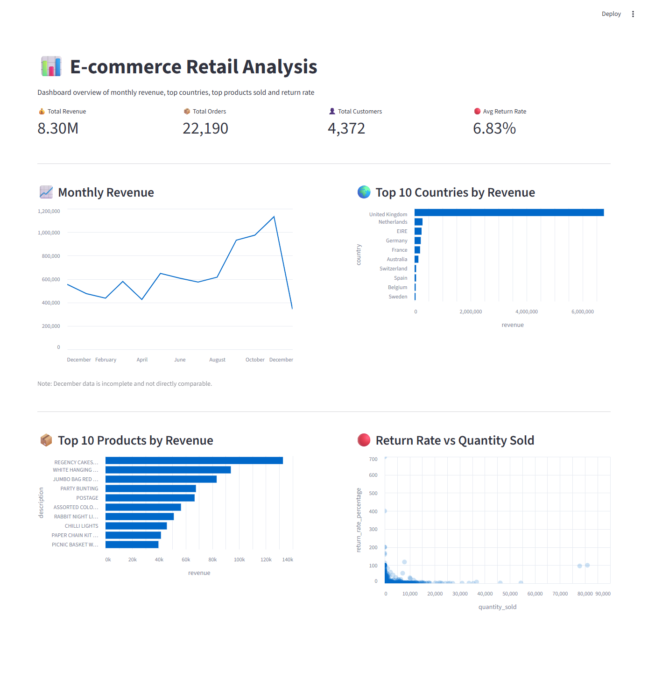

📊 E-commerce Retail Analysis

📌 Project Overview

This project analyzes transactional data from an e-commerce retailer to uncover key business insights related to revenue, customer behavior, product performance, and return patterns.

	The analysis follows an end-to-end approach:

Data cleaning and preparation (SQL)
KPI definition
Exploratory data analysis
Interactive dashboard development (Streamlit)

-----

🎯 Business Questions

	This analysis aims to answer the following:

How does revenue evolve over time?
Which countries drive most of the revenue?
Which products generate the highest revenue?
How do return rates vary across products, and are there any anomalies in return behavior?

-----

🧠 Key Insights

	1. Revenue Trends | Q.1 How does revenue evolve over time?

	Revenue shows a strong upward trend in the second half of the year, with a clear peak in the final months.
	This suggests a significant concentration of sales activity in Q4.
	December data appears incomplete and should not be interpreted as a real decline.

-------------------------------------------------------

	2. Country Performance | Q.2 Which countries drive most of the revenue?

	Revenue is highly concentrated in the United Kingdom, which overwhelmingly dominates all other countries.
	This indicates a strong dependency on a single market, representing both a strength (market leadership) and a risk (geographic concentration).
	Other countries contribute only marginally, suggesting that international markets remain largely underdeveloped and represent a potential area for future growth.

-------------------------------------------------------

	3. Product Performance | Q.3 Which products generate the highest revenue?

	The top-performing products generate significantly higher revenue compared to other items within the top 10.
	This indicates that even among the best-performing products, revenue distribution is uneven, with a clear gap between the leading items and the rest.
	This suggests that certain products play a particularly important role in driving sales and may require focused attention in terms of availability, pricing, and promotion.

-------------------------------------------------------

	4. Return Analysis | Q.4 How do return rates vary across products, and are there any anomalies in return behavior?

	Most products exhibit low return rates, indicating generally stable product performance.
	However, a subset of products shows unusually high return rates, in some cases exceeding 100%. This initially appears inconsistent, but further analysis suggests that returns may be recorded in a 	different time window than the original purchases.

	Additionally, high-volume products tend to have lower return rates, indicating more stable demand and fewer issues.

	This anomaly is due to:
	- Returns occurring in a different time window than purchases
	- Dataset time limitations

-----

🗂️ Dataset

	The dataset was cleaned using the following steps:

Removed rows with missing customer IDs  
Excluded invalid transactions (zero or negative prices)  
Removed zero quantities  

Negative quantities (returns) were preserved to enable return analysis.

-----

🛠️ Tech Stack

SQL (PostgreSQL)
Python (Pandas)
Streamlit
Altair

-----

📊 Dashboard

The dashboard includes:
Monthly revenue trend
Top 10 countries by revenue
Top 10 products by revenue
Return rate analysis

-----

🌐 Live Demo

